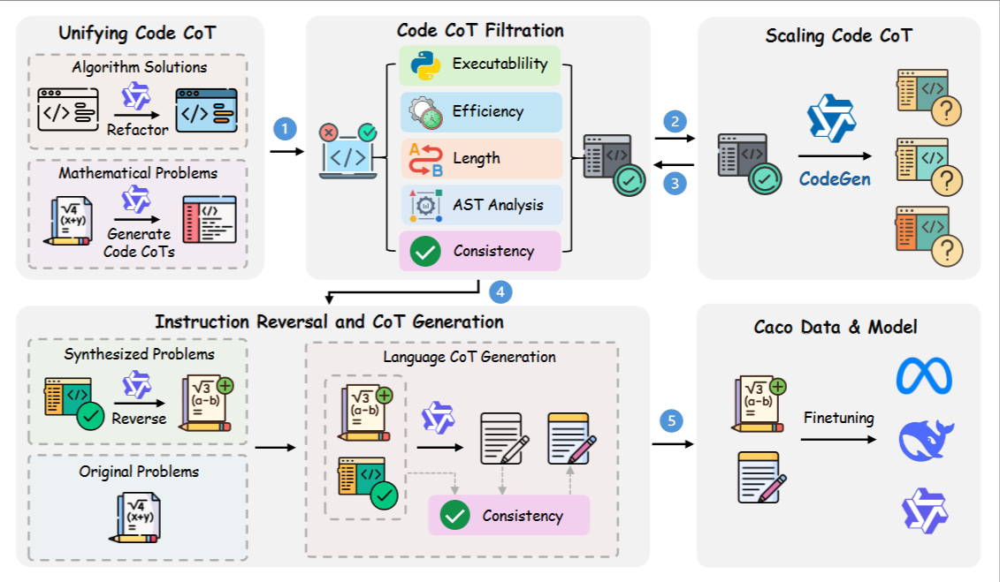

<p align="center">
<h1 align="center">Caco: Scaling Code-Assisted Chain-of-Thoughts and Instructions for Model Reasoning</h1>

<p align="center">
    <a href="https://huggingface.co/papers/2510.04081#68e5d0c3feb464d0df9b07e1"></a>
    <a href="https://github.com/LHL3341/Caco/blob/main/LICENSE"></a>
    <a href="https://huggingface.co/collections/LHL3341/caco-68e0cb7b8a5f0071fac1f611"></a>
</p>

🎉🎉 Caco is accepted by NeurIPS 2025!

We introduce Caco, a code-driven framework for generating diverse and verifiable reasoning data at scale. Unlike conventional augmentation methods that rewrite problems, Caco leverages executable code-based chains of thought (Code CoTs) to synthesize new problems and solutions with guaranteed correctness.

Caco implements this through three key stages:

1. **Unifying Code CoT**, collecting diverse seed reasoning traces from both mathematical and algorithmic problems, and converting them into a standardized executable format.

2. **Scaling Code CoT**, training a dedicated code generator that not only expands the dataset but also realizes Pattern-level Augmentation by restructuring reasoning logic (e.g., decomposition, reformulation, alternative solution paths).

3. **Instruction Reversing**, back-translating code into natural language problems with contextual and stylistic variations, followed by natural language CoT solution generation dual verification for correctness.



Caco yields 1.3M validated problem–solution pairs in under 55 GPU hours using only open-source models. Models trained on Caco data achieve consistent improvements across mathematics, logic puzzles, scientific QA, and code reasoning, surpassing strong baselines and demonstrating broad cross-domain generalization.

We release the Caco dataset and three Caco models fine-tuned on this dataset.

| Dataset/Model | MATH | Olympiad | Theorem-QA | HuggingFace🤗 |
| - | :-: | :-: | :-: | :-: |
| Caco1.3M | - | - | - | [link](https://huggingface.co/datasets/LHL3341/Caco-1.3M) |
| Caco-CodeGen | - | - | - | [link](https://huggingface.co/LHL3341/Caco-CodeGen) |
| DeepSeekMath-7B-Caco | 68.2 | 29.5 | 33.8 | [link](https://huggingface.co/LHL3341/DeepSeekMath-7B-Caco) |
| Qwen2.5-7B-Caco | 82.4 | 46.5 | 46.0 | [link](https://huggingface.co/LHL3341/Qwen2.5-Math-7B-Caco) |
| Llama3-8B-Caco | 70.6 | 34.1 | 31.0 | [link](https://huggingface.co/LHL3341/Llama3-8B-Caco) |

## 🎯 Quick Start
Install the dependencies:

```bash
conda create -n caco python=3.10
conda activate caco
pip install torch==2.3.1 --index-url https://download.pytorch.org/whl/cu121
# Install LLaMA-Factory
git clone https://github.com/hiyouga/LLaMA-Factory.git
cd LLaMA-Factory
git checkout v0.9.1
pip install transformers==4.46.1 accelerate==0.34.2 deepspeed==0.15.4
pip install -e ".[torch,metrics]"
# Install packages for evaluation
pip install flash-attn --no-build-isolation
pip install sympy==1.12.1 antlr4-python3-runtime==4.11.1 pebble word2number boto3 triton==2.3.1 ipython
pip install vllm==0.5.3.post1
# Install latex2sympy
cd ../evaluation_dart/latex2sympy
pip install -e .
cd ..
# Install dart-math evaluation
pip install -e .
```
## ⚙️ Data Generation
You can directly download Caco-1.3M data for training.
```bash
huggingface-cli download LHL3341/Caco-1.3M
```

We also provide our code in `./data_process` for:
- Code execution and input/output extraction
- Answer consistency filteration
- CodeGen training


## 🤖 Training
Our training codes depend on [LLaMA-Factory](https://github.com/hiyouga/LLaMA-Factory).
```bash
bash ./scripts/sft.sh
```

## 📊 Evaluation
```bash
export MODEL_NAME=/path/to/your/model
bash ./scripts/test.sh
```

## 🚀 Future Work
We highlight three directions for extending Caco:

- **Raising Difficulty:** Incorporate harder and cleaner seed datasets (e.g. AM-Thinking-distill, DAPO) and apply hardness-aware sampling with adversarial program mutations.

- **Expanding Diversity:** Extend beyond math to science, logic, proofs and procedural planning. Train multi-domain CodeGen with domain tags and compositional templates.

- **RL with Verifiable Rewards (RLVR):** Caco’s executable traces provide a natural, low-noise reward signal, which can be seamlessly applied to scale up RLVR data.

## Citation
If you find our code, model, or data are useful, please kindly cite our [paper](https://arxiv.org/abs/2510.04081):
```
@article{caco,
 title={Scaling Code-Assisted Chain-of-Thoughts and Instructions for Model Reasoning}, 
 author={Honglin Lin and Qizhi Pei and Xin Gao and Zhuoshi Pan and Yu Li and Juntao Li and Conghui He and Lijun Wu},
 journal={arXiv preprint arXiv:2510.04081},
 year={2025}
}
```
